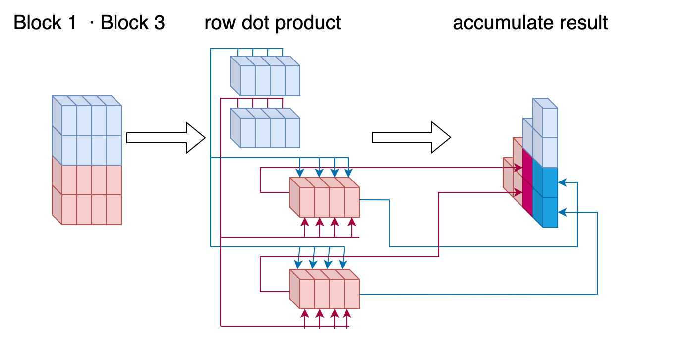
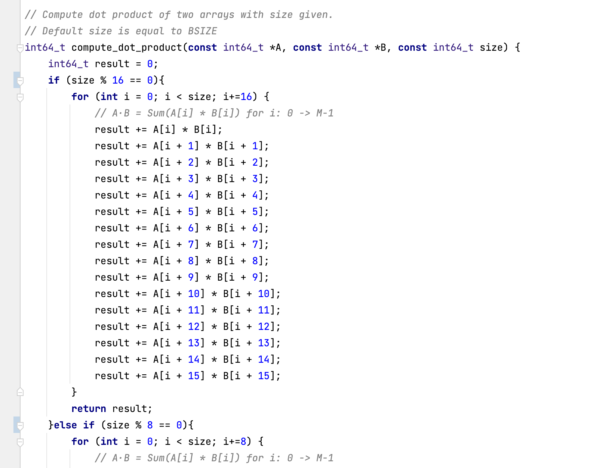

# COMP5426 Assignment 1

### 13 Apr 2020

### SID: 490457890

## Problem definition 
and requirements

In this assignment, we want to calculate a dot product for every possible pair of rows in the matrix. For any matrix containing n rows, we have a total of N*(N+1)/2 pairs. In contrast to matrix multiplication, the data we want to read from dot product are linear. We also only need to save the results on a one-dimensional array. Here, we would like to work out an efficient method for such calculations that supports multiple threads computing. In previous practice, we did this by distributing the computation of each pair evenly to each thread in its order on the result array (which shows in our baseline algorithm). And now we will use loop unrolling, blocking, etc. to design a faster algorithm.

## Parallel algorithm design and implementation

We can visualise our calculation process as the following graph. The diagram below shows the flow of our baseline algorithm in a matrix with N=8 and THREAD_NUM = 4. Where the colour assigned to each box represents the thread to which it is assigned. The text “(0,1)” means it is the dot product of row 0 and row 1. After computing (0,1) we will go to the next value in the linear order, which is (0,2). This algorithm is effective but has a lot of room for improvement. Here's how we improve it..

###  Improving locality By redesign the computation order 

Therefore, the first optimisation we made was to adjust the order of the calculations in order to increase the usage of each read. As shown in the diagram below, the different colours represent the different iteration in the calculation. In this algorithm, we always give preference to a block that has the information we have just read. For example, after we did the computation of (0,2), we will pick (2,2) for next. As we just read the 2nd row during the computation of (0,2) and we assume that it will still keep in cache, results in faster read speeds and thus less time required for calculations. Once we finish the calculation of the outermost layer, we move on to the next layer, which is the calculation of the other colour in the figure.

In multi-threaded computation, in order to increase the usage of data while increasing the usage of multiple cores, we distribute the computation tasks evenly to each thread, as shown in the figure below. We want each thread to be assigned roughly the same number of tasks throughout the computation, so we have chosen to assign them by the sequential order. However, as shown in the figure below, when N=8 and T = 4, the number of computation tasks assigned to each thread is not the same and the difference is quite large. Thread1 only needs to compute 6 times but thread4 needs to compute 12 times. But that will only happened with small number of N. When the value of N goes larger, that is, when we have more rows, the number of computational tasks assigned to each thread will tend to be the same.

### Blocking

Also, in order to optimise the cache performance, during the calculation, we simultaneously distribute the entire matrix evenly into an equal number of blocks. The length (number of columns) in each blocks are user customised, and the width (number of rows) in each box is set to be equal to the number of THREAD_NUM (which is how many threads we are going to use). Because, as mentioned above, we want to ensure that each thread is allocated about the same amount of computation, the width of the block will be smaller compared to the length.

For example, assume we have a matrix with 4 rows and 8 columns, and we have BSZIE = 4 and THREAD_NUM = 2, then we will distribute the matrix into 4 blocks. The number of the blocks are from left to right, then up and down.

For each dot product of a block computation, we will take the dot product of all possible pair from each row in the block, accumulating it to the result matrix. The order of computation, or the block selecting algroithm is just the same as what we show above, same to the Improving locality algorithm we used, just replacing the “row” in the algorithm to “block”.

Here’s a example graph shows each step of a dot computation of two blocks.

### Loop Unrolling

We used loop unrolling in the dot computation process of each row.  As we want to reduce the negative effect from branch prediction of modern pipeline cpus. We separate the computation by the number of size that we are going to compute. And we assume that these numbers (product of 16, product of 8, product of 4) will fits most computation environment.

Here’s a screenshot of one piece of code in our source code.

## Testing and performance evaluation

We created a tool that generates a testing dataset to help us test it. The source code is in src/test/generate.py. And our dataset created can separate into five groups. We run these programs on Apple M1 Pro MacBook, which contains an arm architecture Soc with 10 cores.. With using Clang as the compiler.

We use the linux built in function “date” to evaluate the running time of each group of computation in millisecond. And we also used google profiling tools to help us analyse our program performance.

Group 1: Four files. Each file contains 20 matrix that with random column and rows. The number of columns and rows (or, M and N) are smaller than 100.

Here’s the performance result from each file, with BSIZE = 16/32 and THREAD_NUM = 4/8.

Group 2: Four files. Each file contains 20 matrix that with random column and rows. The number of columns and rows (or, M and N) are smaller than 2500.

Group 3: Matrix has M = N, M starts from 50 to 950 and differs by 50. For each M we compute 20 matrix with random generated values.

This is the result generates from the Google CPU profiler, with computing the largest dataset (dataset 7). The statistics of the locations where the sampling occurred are shown in the figure. The number of samples is sufficient enough that allowing us to  investigate the internal operating, or the efficiency of our program.

## Discussion

From the graph above, we can clearly see that the performance of our algorithm relative to baseline is not a significant improvement on small size datasets. The performance improvement can also be up to 25% as the data set grows larger.

At the same time, as we know, the increase in the number of cores also leads to an increase in the speed of the algorithm, although in our algorithm, such an increase is not very large, around 30%.

The increase in BSIZE size can also lead to performance gains, but of course we think this is related to the experimental computer architecture, and different results are likely to occur on x86 architectures since x86-64 computers usually has a cache line size of 64 byte, and our experimental environment, the arm architecture, has a cache line size of 128 bytes. So the performance gain from adding BSIZE may not be as significant on x86 computers.

From the result of google CPU Profiler, we can see that our program spent most of time on computation (The “compute_dot_product” function) or gathering the metadata needs for computation (“block_computation_multithread”). This result is satisfactory enough.

## Known issues in program

On smaller datasets, sometimes our algorithm is even slower than baseline. It is worth mentioning that smaller datasets also suffer from the problem of less accurate environments. In our experiments the same algorithm running on the same small data set sometimes gives extremely inaccurate results. 

As we mentioned above, the results may be slightly different on the other platform, as we performed the relevant tests on the arm platform. Our programs can still be optimized for specific architectures to make fuller use of cache.

Since different operating systems also have different caching policies, there may be some errors in our test results. We tried to use a large, random and repeated data set in our tests, but some errors were still unavoidable. For example, we once recorded a test result of over 800ms on a smaller data set. This should be below 50ms under normal circumstances.

## Manual 

In the main folder, just press `make` for compiling the two programs. The object files will store in the folder `obj/`. The baseline program will be  `obj/baseline.o`. The efficient program will be `obj/efficient.o`.

If you want to change some environment variables, such as how many threads we are going to use, go to `src/include` and change the macro `THREAD_NUM` in the relevant header file. For changing the block size of the algorithm, go to `src/include/efficient.h` and change the macro `BSIZE`.

If you want to disable the self-checking, go to `src/include` and comment the macro `SELF_CHECK` in relevant header file.

If you want to generate tests, the generator is locate in `src/tests/generate.py`. But be careful, the files that generate might be very large.

To run the program, just run the related object file. The program will ask you to enter M and N of the matrix first, then enter every elements in the matrix. The program will print the computation result in stdout. We provide a sample input file in `src/tests`.